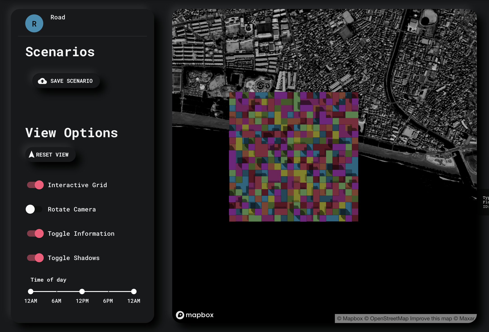
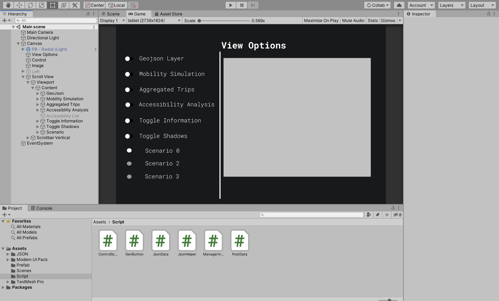
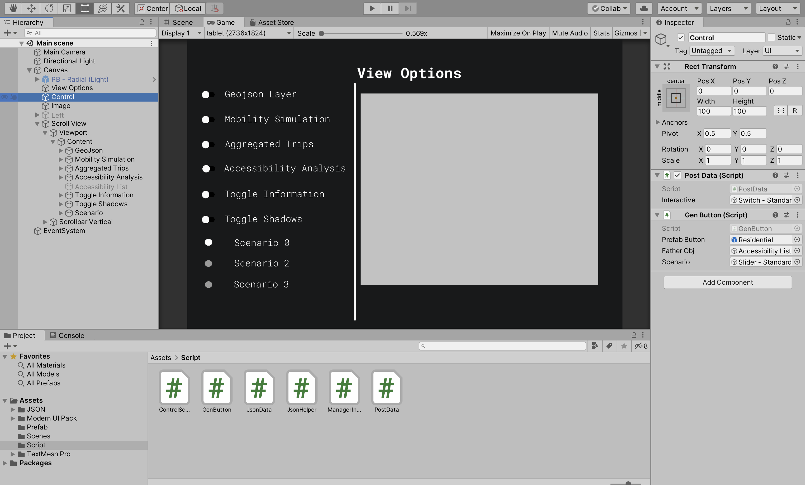

# Tablet_CityScienceLab

Application used to control the TV screen display information

# Getting Started

## How does this work?

Currently to control the way properties (on / off) of the project through the website, this takes up area of the display screen and can be distracting when viewing. This project solves that problem by separating the controls, which will be launched separately on the tablet. The TV screen now only shows the map.


 
## Package Installation

### Prerequisites

```
Unity 2019.4.x
Visual studio 2019
```

## Some Main Functions

|       Class       |                       Description                             |
|       :----:      |                       :----                                   |
|   [PostData](https://github.com/viettham1998/Tablet_CityScienceLab/blob/master/Assets/Script/PostData.cs)               | Function that manages data post, control information              |
|   [GenButton](https://github.com/viettham1998/Tablet_CityScienceLab/blob/master/Assets/Script/GenButton.cs)             | Get data from the server, create a button based on the data taken from the server when pressing the Accessibility Analysis button  |
|   [ControlScenario](https://github.com/viettham1998/Tablet_CityScienceLab/blob/master/Assets/Script/ControlScenario.cs) | Control the selection of Scenario                                 |
|   [JsonHelper](https://github.com/viettham1998/Tablet_CityScienceLab/blob/master/Assets/Script/JsonHelper.cs)           | Serving data conversion                                 |


## Screenshots

<details>
  <summary>Click to expand!</summary>





</details>